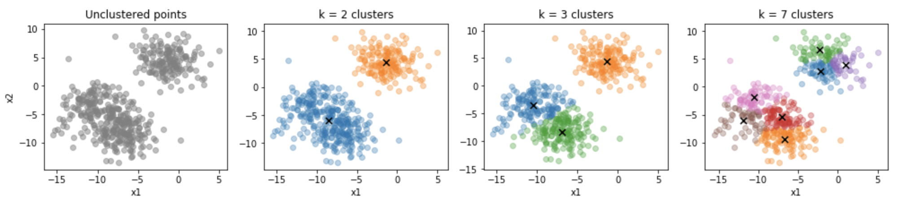

# kmeans-exploration
An implementation and visualization of the k-means and k-means++ clustering algorithms.

The problem of *clustering* comes up often in machine learaning, where we want to assign a category or group to a set of data points that are similar.  If we imagine the _x-y_ plane, with points scattered around, it might be easy to visually group these points into a number of clusters based on proximity; points that are close to each other are assigned the same cluster.  Similar, in 3D space, points -- or in this case, vectors -- that are close to each other should belong together.

While our eyes can cluster points in 2D or even 3D space with relative ease, what happens when we have a large number of points, say, a few million, or if the "points" we are working with are really _p_-dimensional vectors?  We need an algorithm that can efficiently cluster points for us, regardless of scale or dimension.

The **k-means algorithm** is one solution to the clustering problem: Given _n_ _p_-dimensional vectors, assign each vector to one of _k_ clusters based on Euclidean distance.  Each cluster has a _centroid_, which is simply the mean vector of that cluster.

See [notebook](https://github.com/ajcheon/kmeans-exploration/blob/master/kmeans.ipynb) for a deep dive into the k-means clustering algorithm.
